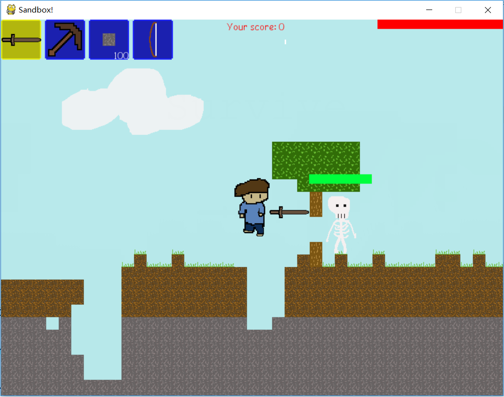

# "Survive" - A Terraria-like Sandbox Game

## Play the game 

Please install ``pygame`` to play this.

Use `` py game.py `` to play

Map is stored as map.mp in the current directory. You can regenerate map
by deleting it and running the game program.

## Basic Rules

### Items

You have four items - a shortsword, a pickaxe, 100 stone blocks, and a bow.

Shortsword - Poke to left or right

Pickaxe - Dig blocks

Stone blocks - Obstruct your enemies

Bow - Shoot arrows to left or right

### Powerups

You can dig special ores to increase your damage and your score

### Enemies

Three types of enemy will try to kill you - skeletons, lava monsters, and dynamite monsters

Skeletons - Rush towards you

Lava monsters - Rare, jump towards you, high contact damage

Dynamite monsters - Explode when close for 3 seconds (timer will be shown), but can be exploited to attack other enemies.

## Game Preview

